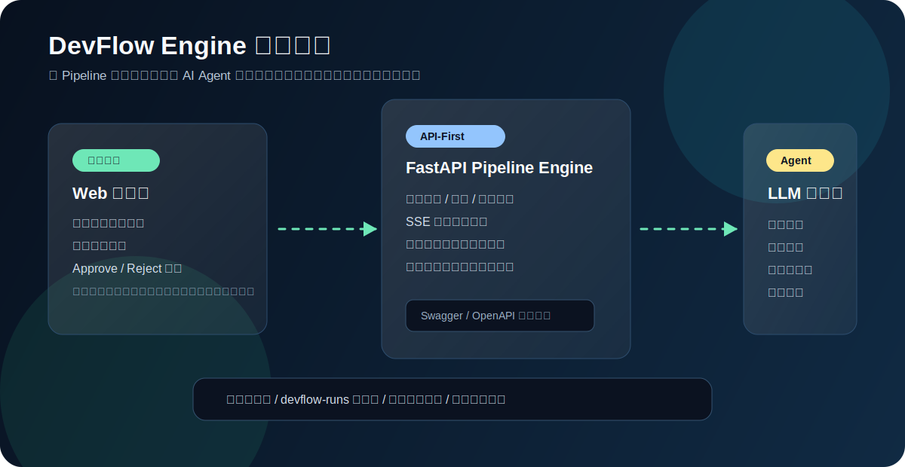
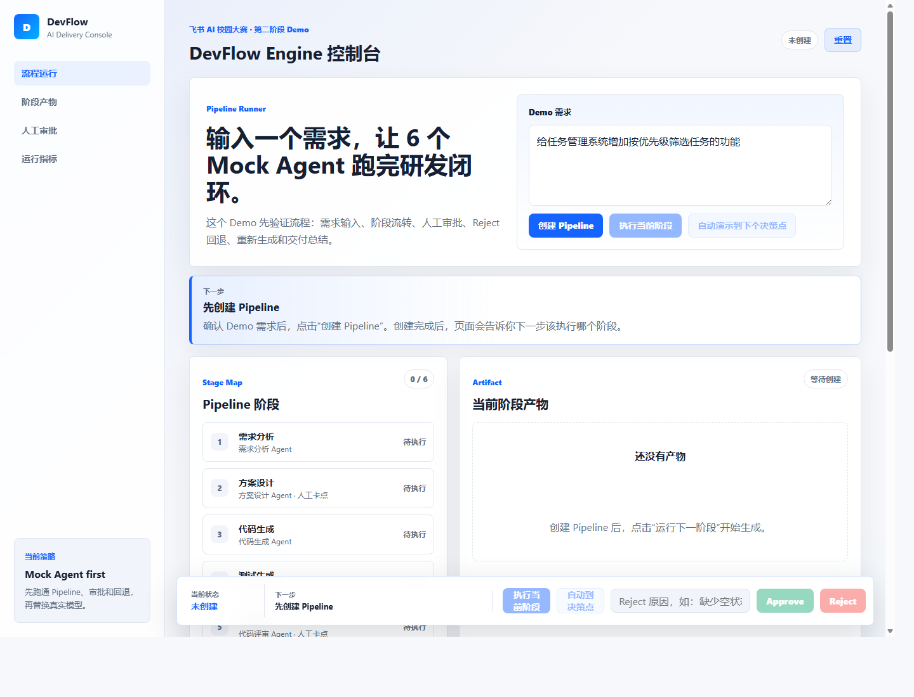
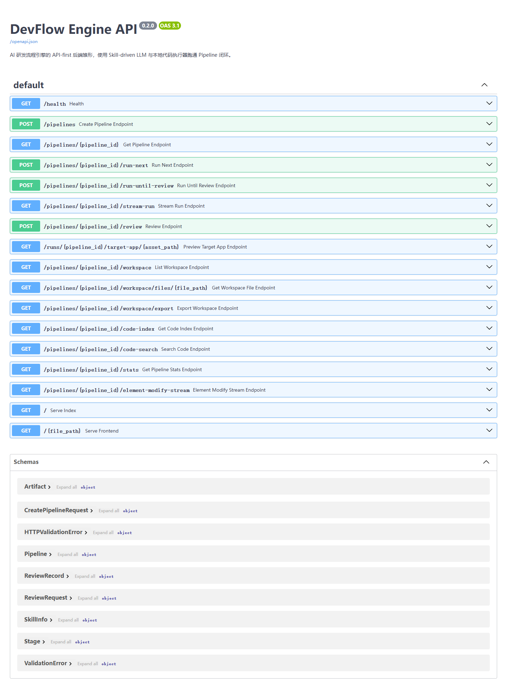
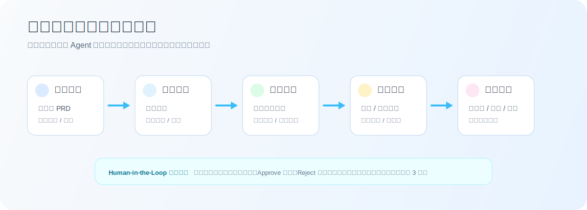

# DevFlow Engine

> AI 驱动的需求交付流程引擎。输入一句自然语言需求，系统会把它编排为「需求分析 - 方案设计 - 代码生成 - 测试生成 - 代码评审 - 交付总结」的完整 Pipeline，由专属 AI Agent 执行每个阶段，并在关键节点交给人类 Approve / Reject。




## 项目定位

DevFlow Engine 面向「AI Native 研发范式」赛题，不是一个单点代码生成工具，而是一套可运行的研发流程引擎。它把真实软件交付拆成可追踪、可审批、可回退的阶段，并让 AI Agent 在每个阶段承担明确职责。

它回答的是 PDF 命题里的核心问题：如何让 AI 从「副驾驶」变成研发流程的「主驾驶」，同时保留人类在关键节点的决策权。

## 交付要求对照

| PDF 要求 | 本项目实现 |
|---|---|
| Pipeline 引擎 | `backend/pipeline_engine.py` 定义阶段、顺序、生命周期、审批状态与回退逻辑 |
| Agent 编排与执行 | `skills/` 为每个阶段提供 System Prompt / 输入输出契约，`backend/llm_runner.py` 负责模型调用 |
| Human-in-the-Loop 检查点 | 每个阶段产物生成后进入 `waiting_review`，支持 Approve / Reject，Reject 必须填写原因 |
| API-First 架构 | FastAPI 暴露 Pipeline 创建、执行、审批、统计、工作区、代码检索等 REST API |
| 端到端可运行演示 | 从自然语言需求到目标工程代码变更、测试、评审、交付总结均可在本地跑通 |
| Docker 一键部署 | 提供 `Dockerfile` 与 `docker-compose.yml`，默认映射到 `8001` 端口 |
| 技术文档与测试报告 | `docs/` 包含阶段设计、MVP 定义、展示文档；`tests/` 与 `backend/tests/` 覆盖核心逻辑 |
| 加分项 | 多 Agent 并行评审、自动回归重试、实时可观测面板、代码语义索引、Pipeline 模板、运行工作区导出 |

## 产品截图

控制台承担需求输入、阶段推进、产物审阅、审批决策与工作区查看。



API 文档由 FastAPI 自动生成，评委可以直接在浏览器里调试核心接口。



## 核心流程



1. 用户输入自然语言需求，例如「给任务管理应用增加暗色模式」。
2. 需求分析 Agent 生成结构化 PRD、验收标准与需求原型。
3. 人类审阅产物，选择 Approve 继续，或 Reject 带原因打回重做。
4. 方案设计 Agent 分析现有代码结构，输出技术方案和动态蓝图。
5. 代码生成 Agent 修改目标工程，并在运行工作区中保存变更。
6. 测试生成 Agent 为变更生成可运行测试。
7. 代码评审阶段由正确性、安全性、规范性三个 Agent 并行审查。
8. 交付总结 Agent 汇总变更、测试结果、风险与交付说明。

## 亮点能力

**1. 真正的流程编排，而不是固定 Demo**

系统支持三类 Pipeline 模板：`feature`、`bugfix`、`refactor`。阶段不是写死在前端里的展示文案，而是后端状态机驱动的真实流程。

**2. 每个阶段都有独立 Agent 职责**

`skills/requirements-analysis.skill.md`、`technical-design.skill.md`、`code-change.skill.md` 等文件定义了阶段目标、输入、输出与质量约束。Agent 不共享一个泛化提示词，而是按研发角色分工。

**3. Human-in-the-Loop 可回退闭环**

每个阶段产出后都会暂停。人类可以通过 UI 或 API 审批；Reject 会清理当前阶段产物并回到上一阶段。代码评审阶段支持自动回归，最多重试 3 次，防止无限循环。

**4. 多 Agent 并行代码评审**

`backend/multi_agent.py` 在评审阶段并行启动三个独立审查 Agent：正确性审查、安全性审查、规范性审查。系统再把结果聚合成一份综合评审报告。

**5. 可观测、可检索、可导出**

系统记录每阶段耗时、Token 消耗、模型名、产物、变更文件和工作区路径。`code-index` 与 `code-search` 接口提供轻量语义索引，方便 Agent 和评委定位代码。

## 技术架构

```text
浏览器控制台
  | 需求输入 / 审批 / SSE 实时输出 / 预览
  v
FastAPI API 层
  | Pipeline CRUD / 执行触发 / Review / Stats / Workspace / Code Search
  v
Pipeline Engine
  | 阶段状态机 / 模板 / 审批回退 / 自动回归
  v
Agent 执行层
  | Skill-driven Prompt / LLM Provider Router / 多 Agent 并行
  v
运行工作区
  | target-app 副本 / 生成代码 / 测试 / 工作区文件 / 导出包
```

主要文件：

| 路径 | 作用 |
|---|---|
| `backend/main.py` | FastAPI 入口与 REST / SSE 接口 |
| `backend/pipeline_engine.py` | Pipeline 模板、状态流转、审批与回归逻辑 |
| `backend/llm_runner.py` | LLM 调用、模型路由、阶段上下文构造 |
| `backend/code_executor.py` | 目标工程复制、代码生成落盘、测试补丁应用 |
| `backend/multi_agent.py` | 评审阶段多 Agent 并行与结果汇总 |
| `backend/code_indexer.py` | HTML/CSS/JS 轻量语义索引与搜索 |
| `pipeline-core.js` | 前端 Pipeline API 客户端与阶段轮盘逻辑 |
| `skills/` | 六个阶段的 Agent 工作规范 |
| `target-app/` | 被 DevFlow 修改的示例目标工程 |

## 快速运行

### 方式一：Docker Compose

Windows PowerShell：

```powershell
.\setup_env.ps1
docker compose up -d --build
```

也可以手动配置：

```bash
cp .env.example .env
# 编辑 .env，填入 DEVFLOW_LLM_API_KEY
docker compose up -d --build
```

启动后访问：

- 控制台：http://localhost:8001
- Swagger API：http://localhost:8001/docs

为了方便评委老师下载后使用，项目提供了 `setup_env.ps1` 和 `.env.example`。评审用 API Key 请通过复赛平台私密备注或其他非公开方式提供。

### 方式二：本地运行

```bash
pip install -r requirements.txt
```

Windows PowerShell：

```powershell
.\setup_env.ps1
python -m uvicorn backend.main:app --host 0.0.0.0 --port 8001 --reload
```

Linux / macOS：

```bash
export DEVFLOW_LLM_ENABLED=true
export DEVFLOW_LLM_BASE_URL=https://api.lingyaai.cn
export DEVFLOW_LLM_API_KEY="你的 API Key"
python -m uvicorn backend.main:app --host 0.0.0.0 --port 8001 --reload
```

> 不建议把真实 API Key 提交到 GitHub。若旧 Key 曾经进入仓库历史，请立即在平台中作废并重新生成临时 Key。

## API 一览

| 方法 | 路径 | 说明 |
|---|---|---|
| `GET` | `/health` | 健康检查 |
| `POST` | `/pipelines` | 创建 Pipeline |
| `GET` | `/pipelines/{id}` | 查询 Pipeline 状态 |
| `POST` | `/pipelines/{id}/run-next` | 执行当前阶段 |
| `POST` | `/pipelines/{id}/run-until-review` | 自动运行到下一个检查点 |
| `GET` | `/pipelines/{id}/stream-run` | SSE 流式执行输出 |
| `POST` | `/pipelines/{id}/review` | 提交 Approve / Reject |
| `GET` | `/pipelines/{id}/stats` | 查询阶段耗时与 Token 统计 |
| `GET` | `/pipelines/{id}/workspace` | 查看运行工作区文件 |
| `GET` | `/pipelines/{id}/workspace/export` | 导出交付工作区 zip |
| `GET` | `/pipelines/{id}/code-index` | 查看代码语义索引摘要 |
| `GET` | `/pipelines/{id}/code-search` | 搜索目标工程代码 |
| `GET` | `/runs/{id}/target-app/{path}` | 预览生成后的目标工程页面 |

## 测试

```bash
pytest backend/tests/test_pipeline_api.py -v
node tests/pipeline-core.test.js
node tests/artifact-renderer.test.js
node tests/clarification-flow.test.js
```

当前测试覆盖：

- Pipeline API 创建、执行、审批、状态查询
- 阶段轮盘与 API 客户端逻辑
- 产物渲染器
- 澄清问题与流程交互

## 目录结构

```text
.
|-- backend/                 # FastAPI 后端、Pipeline 引擎、Agent 编排
|-- skills/                  # 六个阶段的 Agent 工作规范
|-- target-app/              # 示例目标工程，供 DevFlow 修改
|-- tests/                   # 前端核心逻辑测试
|-- backend/tests/           # 后端 API 测试
|-- docs/                    # 设计文档、展示材料与图片资源
|-- devflow-runs/            # Pipeline 运行时工作区
|-- index.html               # DevFlow 控制台
|-- script.js                # 前端交互逻辑
|-- styles.css               # 控制台样式
|-- pipeline-core.js         # Pipeline 客户端与阶段展示逻辑
|-- Dockerfile
|-- docker-compose.yml
`-- README.md
```

## 交付物清单

- 完整源代码：前端、后端、Agent Skill、示例目标工程。
- 可运行程序：Docker Compose 或本地 Python 环境均可启动。
- 技术文档：`docs/项目展示文档.md`、`docs/阶段输入输出与Agent设计.md`、`docs/MVP定义.md`。
- 测试材料：`backend/tests/` 与 `tests/`。
- 演示材料：控制台截图、Swagger 截图、架构图、流程图。
- 运行产物：每次 Pipeline 会在 `devflow-runs/` 生成独立工作区，可预览、检索、导出。
